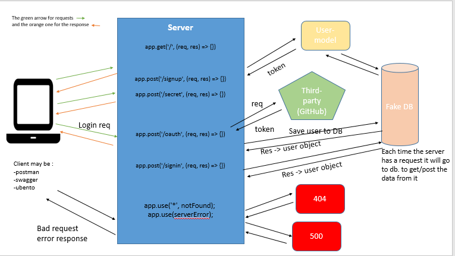

# auth-server

## Author: Israa Othman 

## Links and Resourcs 
  -  [lab-11 PR](https://github.com/401-advanced-javascript-israaOthman/auth-server/pull/1)  
  -  [lab-12 PR](https://github.com/401-advanced-javascript-israaOthman/auth-server/pull/4)  
  -  [lab-13 PR](https://github.com/401-advanced-javascript-israaOthman/auth-server/pull/3)  
  -  [lab-15 PR](https://github.com/401-advanced-javascript-israaOthman/auth-server/pull/5)  

  ## Setup 
   - `.env` requirment 
   - PORT=3000
   - MONGODB_URI='mongodb://localhost:27017/oauth'
   - SECRET='secret-oauth'
   - CLIENT_ID=4a1f1b6ffe2a5bef2d1f
   - CLIENT_SECRET=a18972c7ffaea2523b8738384b8870b27e3c46c6
   - API_SERVER='http://localhost:3000/oauth'
   - tokenServerUrl='https://github.com/login/oauth/access_token'
   - remoteUserApi='https://api.github.com/user'

  #### How to initialize/run your application  
  using postman or swagger  
- get all users : GET - http://localhost:3000/users
-  signup : POST -  http://localhost:3000/signup/
    + body = {username : 'some name' , password : 'pass'}
-  signin : POST -  http://localhost:3000/signup/
    + Authoraization --> enter the username and the paeeword 
- add : POST - http://localhost:3000/add
- read: GET - http://localhost:3000/read
- change : PUT - http://localhost:3000/change
- delete : DELETE - http://localhost:3000/delete
   

  # UML 
    
